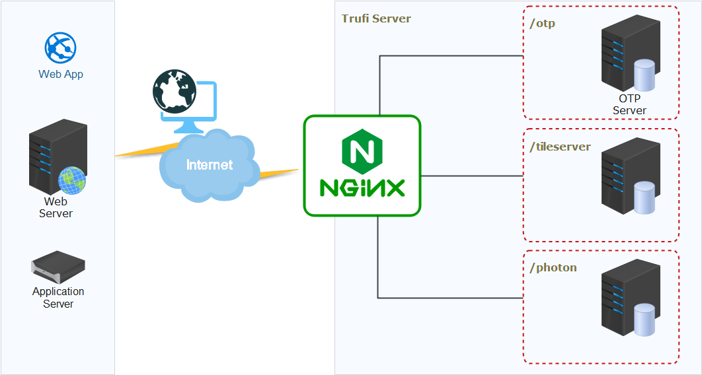

# Trufi Server - Vanilla
This repository enables the creation of a robust production backend environment, specifically designed to support the customized iteration of the Trufi App. It empowers users to establish and deploy their own personalized Trufi App instances, harnessing its full potential.

## Struct

