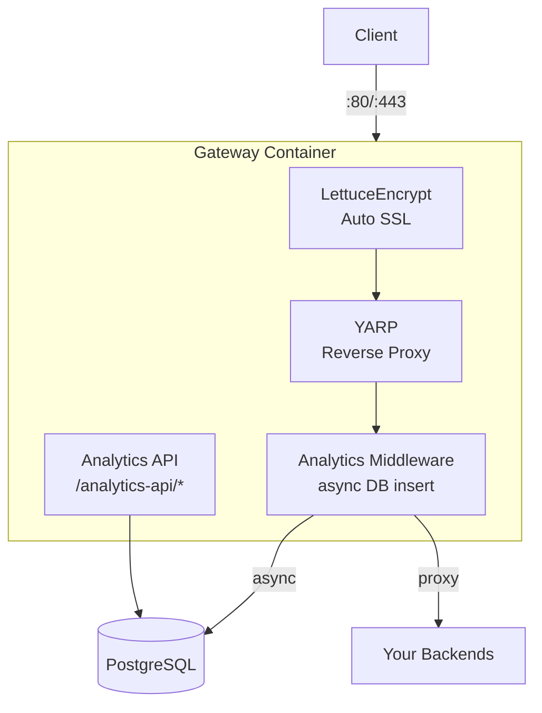

# Trufi Server

Production backend for the Trufi App with built-in analytics and automatic SSL.

## Features

- **YARP Reverse Proxy**: High-performance .NET reverse proxy by Microsoft
- **Automatic SSL**: Let's Encrypt certificates via LettuceEncrypt (auto-renewal)
- **Request Analytics**: All requests logged to PostgreSQL (async, non-blocking)
- **Multi-route support**: Route by path (`/api/*`) or subdomain (`api.domain.com`)

## Architecture



## Quick Start

### 1. Clone and configure

```bash
git clone https://github.com/trufi-association/trufi-server.git
cd trufi-server
```

### 2. Edit `server/src/Gateway/appsettings.json`

```json
{
  "LettuceEncrypt": {
    "AcceptTermsOfService": true,
    "DomainNames": ["yourdomain.com", "api.yourdomain.com"],
    "EmailAddress": "admin@yourdomain.com"
  },
  "ReverseProxy": {
    "Routes": {
      "my-api": {
        "ClusterId": "my-api",
        "Match": { "Hosts": ["api.yourdomain.com"] }
      }
    },
    "Clusters": {
      "my-api": {
        "Destinations": {
          "primary": { "Address": "http://my-backend:8080" }
        }
      }
    }
  }
}
```

### 3. Start

```bash
docker compose up -d
```

---

## Adding New Domains and Proxies

### Step 1: Add domain to SSL

Edit `server/src/Gateway/appsettings.json` and add your domain to `LettuceEncrypt.DomainNames`:

```json
{
  "LettuceEncrypt": {
    "AcceptTermsOfService": true,
    "DomainNames": [
      "yourdomain.com",
      "api.yourdomain.com",
      "newservice.yourdomain.com"  // <-- Add new domain
    ],
    "EmailAddress": "admin@yourdomain.com"
  }
}
```

### Step 2: Add route and cluster

Add a new route in `ReverseProxy.Routes` and a cluster in `ReverseProxy.Clusters`:

```json
{
  "ReverseProxy": {
    "Routes": {
      "newservice": {
        "ClusterId": "newservice",
        "Match": { "Hosts": ["newservice.yourdomain.com"] }
      }
    },
    "Clusters": {
      "newservice": {
        "Destinations": {
          "primary": { "Address": "http://newservice-container:3000" }
        }
      }
    }
  }
}
```

### Step 3: Restart server

```bash
docker compose restart server
```

SSL certificates are obtained automatically.

---

## Route Configuration Examples

### Subdomain routing

Route `api.yourdomain.com` to a backend:

```json
{
  "Routes": {
    "api": {
      "ClusterId": "api",
      "Match": { "Hosts": ["api.yourdomain.com"] }
    }
  },
  "Clusters": {
    "api": {
      "Destinations": {
        "primary": { "Address": "http://api-backend:8080" }
      }
    }
  }
}
```

### Path-based routing

Route `yourdomain.com/api/*` to a backend:

```json
{
  "Routes": {
    "api": {
      "ClusterId": "api",
      "Match": { "Path": "/api/{**catch-all}" },
      "Transforms": [{ "PathRemovePrefix": "/api" }]
    }
  },
  "Clusters": {
    "api": {
      "Destinations": {
        "primary": { "Address": "http://api-backend:8080" }
      }
    }
  }
}
```

### Multiple backends (load balancing)

```json
{
  "Clusters": {
    "api": {
      "LoadBalancingPolicy": "RoundRobin",
      "Destinations": {
        "server1": { "Address": "http://api-1:8080" },
        "server2": { "Address": "http://api-2:8080" }
      }
    }
  }
}
```

### Complete example

```json
{
  "LettuceEncrypt": {
    "AcceptTermsOfService": true,
    "DomainNames": [
      "trufi.yourdomain.com",
      "photon.yourdomain.com",
      "otp.yourdomain.com"
    ],
    "EmailAddress": "admin@yourdomain.com"
  },
  "ReverseProxy": {
    "Routes": {
      "photon": {
        "ClusterId": "photon",
        "Match": { "Hosts": ["photon.yourdomain.com"] }
      },
      "otp": {
        "ClusterId": "otp",
        "Match": { "Hosts": ["otp.yourdomain.com"] }
      }
    },
    "Clusters": {
      "photon": {
        "Destinations": {
          "primary": { "Address": "http://photon:2322" }
        }
      },
      "otp": {
        "Destinations": {
          "primary": { "Address": "http://opentripplanner:8080" }
        }
      }
    }
  }
}
```

---

## Analytics API

All proxied requests are logged automatically. Access analytics at `/analytics-api/*`:

| Endpoint | Description |
|----------|-------------|
| `/analytics-api/swagger` | Swagger UI documentation |
| `/analytics-api/logs` | Get logged requests |
| `/analytics-api/logs?host=api.domain.com&limit=100` | Filter by host |
| `/analytics-api/logs?from=2024-01-01&to=2024-01-31` | Filter by date |
| `/analytics-api/stats` | General statistics |
| `/analytics-api/stats/hourly` | Requests per hour |
| `/analytics-api/stats/endpoints` | Top endpoints |
| `/analytics-api/stats/devices` | Top devices |

---

## Project Structure

```
trufi-server/
├── docker-compose.yml
├── server/
│   ├── Gateway.sln
│   ├── src/
│   │   ├── Gateway/                 # Host (YARP, SSL, Swagger)
│   │   │   ├── Program.cs
│   │   │   ├── appsettings.json     # <-- Configure here
│   │   │   └── Dockerfile
│   │   ├── Gateway.Analytics/       # Analytics API (logs, stats)
│   │   │   ├── Controllers/
│   │   │   └── Services/
│   │   ├── Gateway.Middleware/      # Request interceptor
│   │   │   └── AnalyticsMiddleware.cs
│   │   └── Gateway.Shared/          # Models, DbContext, Migrations
│   │       ├── Data/
│   │       ├── Models/
│   │       └── Services/
│   └── tests/
│       ├── Gateway.Shared.Tests/        # Unit tests for RequestService
│       ├── Gateway.Analytics.Tests/     # Unit tests for StatsService
│       └── Gateway.IntegrationTests/    # API integration tests
├── diagram/
│   └── architecture.md
└── data/                            # Persistent data (gitignored)
    ├── postgres/
    ├── certificates/
    └── lettuce-encrypt/
```

---

## Operations

```bash
# Start
docker compose up -d

# Stop
docker compose down

# View logs
docker compose logs -f server

# Rebuild after code changes
docker compose up -d --build

# Restart after config changes
docker compose restart server

# Health check
curl localhost/health
```

---

## Development

```bash
cd server
dotnet build Gateway.sln
dotnet run --project src/Gateway  # http://localhost:5000
```

---

## Testing

```bash
cd server

# Run all tests
dotnet test

# Run specific test project
dotnet test tests/Gateway.Shared.Tests
dotnet test tests/Gateway.Analytics.Tests
dotnet test tests/Gateway.IntegrationTests

# Run with verbose output
dotnet test --logger "console;verbosity=detailed"
```

### Test Projects

| Project | Type | Description |
|---------|------|-------------|
| Gateway.Shared.Tests | Unit | Tests for RequestService (CRUD operations) |
| Gateway.Analytics.Tests | Unit | Tests for StatsService (aggregations, filters) |
| Gateway.IntegrationTests | Integration | End-to-end API tests using WebApplicationFactory |

### Adding New Tests

1. **Unit tests**: Add to the corresponding `.Tests` project in `tests/`
2. **Integration tests**: Add to `Gateway.IntegrationTests` using the `CustomWebApplicationFactory`

Example unit test:

```csharp
[Fact]
public async Task MyService_ShouldDoSomething()
{
    // Arrange
    using var context = CreateInMemoryContext();
    var service = new MyService(context);

    // Act
    var result = await service.DoSomething();

    // Assert
    Assert.NotNull(result);
}
```

---

## Tech Stack

- [YARP](https://github.com/microsoft/reverse-proxy) - Microsoft's reverse proxy
- [LettuceEncrypt](https://github.com/natemcmaster/LettuceEncrypt) - Auto SSL certificates
- PostgreSQL 16
- .NET 10

---

## License

Trufi Association
